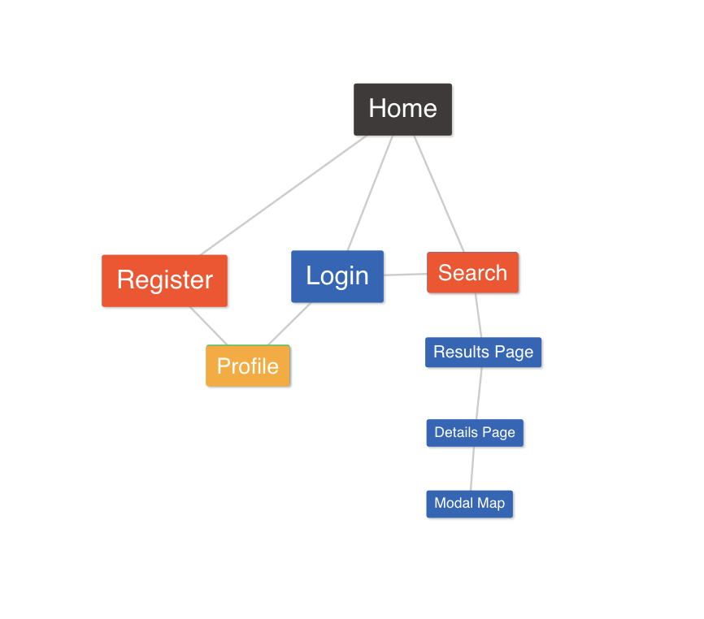

#Spec
- **Feature Definitions**
    - __Back End__
        - Bridge API call
        - CrimeReports API call
        - Routing
            - GET listings /api/bridge
            - GET lat lng of specific listing /api/bridge/:propertyid
            - GET crimes within radius of lat long /api/crime/:location (location is object with lat and lng)
            - GET user info /user/:id
            - GET likes on property /property/:id/likes
            - GET saved property /property/:id
            - POST create user /user
            - POST login user /user/login
            - POST save property /property
            - PUT update user info /user/:id
            - PUT add property to favorites /property/:id/likes
            - PUT update likes to property /property/:id/likes
            - DELETE remove property from user /user/properties/:id
            - DELETE remove user /user/:id
            - DELETE remove property /property/:id
    
    - __Front End__ 
        - __Pages__
            - HomePage Component
            - ProfilePage Component
            - RegisterPage Component
            - LoginPage Component
            - ResultsPage Component
            - DetailsPage Component
        - __Components__
            - NavigationHeader Component
            - Search Component
            - Footer Component
            - LoginForm Component
            - RegisterForm Component
            - ResultsItem Component
            - DetailsBanner Component
            - FamilyFriendlyRating Component
            - CrimeMap Component
            - CrimeCard Component
            - Description Component
            - AgentContactForm Component
            - DetailsImage Component
            - PropertyDetails Component
            - RecentCrimeReports Component
            
        
- **Sitemap**

           
- **Interface**
    - _Information Architecture_
        - HomePage Nav: HOUSE FAX Austin
            - "Family friendly property search"
        - NavLinks: Login/Logout Register/Profile Contact
        - FooterLinks: 
            - Pages: Login Contact About
            - Data Resources: Bridge API, Crime Reports API, Google APis
            - Inspiration: Zillow, Trulia, Redfin
            - Social Media: Facebook, Twitter, Instagram, Medium, Pinterest
        - Search Supporting text: Family friendly property search:
        - Search text: Search for a property
        - Results page supporting text: 
            - Austin, TX homes for sale and rent
            - Results Items: Price, Address, City, State, zip, Details(button)
        - Details Page:
            - Banner: Address, City, State, Zip, Price, beds, baths, 
            residence type, build year, likes, like button
            - Family Friendly Rating, rating number
            - Agent Contact Form:
                - Listing Agent:
                    - Name, Agency, Phone number
                - Form: Name, Phone, Email, Message
                    - Message Text: Hi I am interested in (address)
            - Recent Crimes:
                - Crime type, how long ago, VIEW ON MAP(button)
            - Property Details:
                - Residence type, beds, baths, build year, sq ft, price per sq ft, hoa $per month
                - Remarks from property API        
    - _Browser Support_
        - Chrome 72+
- **Infrastructure**
    - _Technical Requirements_
        - MongoDB: used for data storage
        - React JS
        - React Redux
        - AXIOS
        - Node JS
        - Express JS
        - Create-react-app
        - Babel
    - _Programming Languages_
        - ES6 Javascript
        - CSS3
        - HTML5
    - _Integrations_
        - Bridge API for MLS data
        - CrimeReports API from austintexas.gov integrated into Socrata API network.
    - _Deployment Workflow_
        - 1.0.0: MLS features and crime reporting and mapping works
    - _Web Host_
        - Heroku for main application.
        - MLAB for mongoDB hosting.

[Back](README.md)
